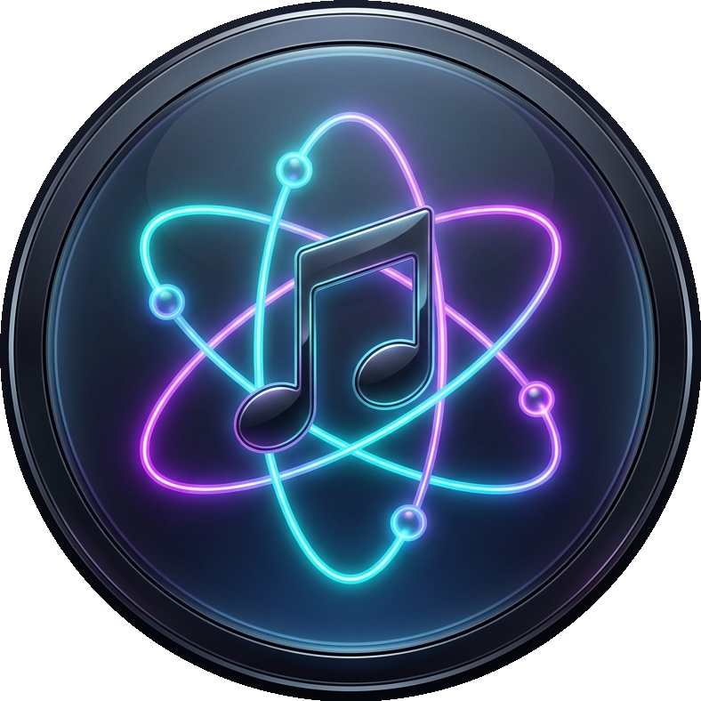
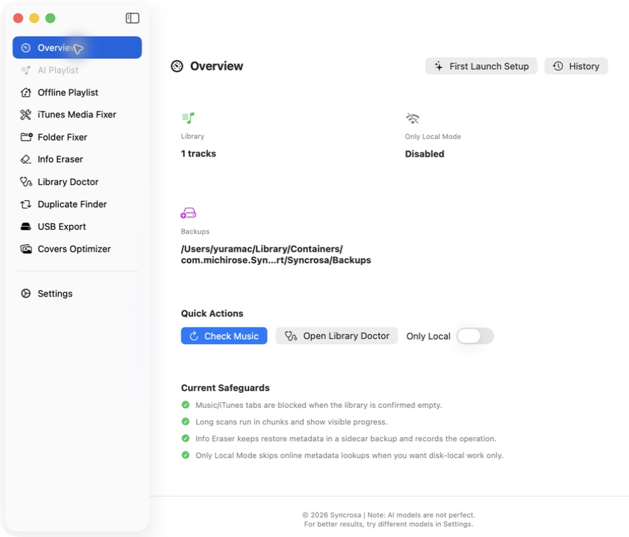
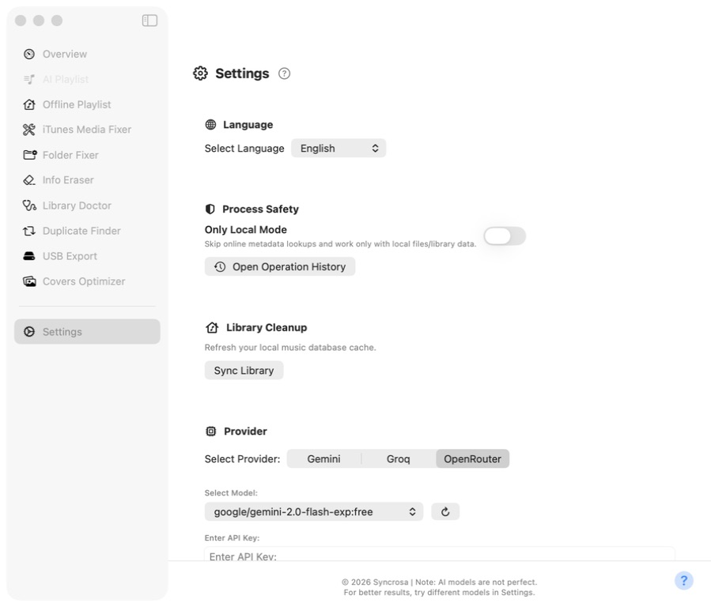
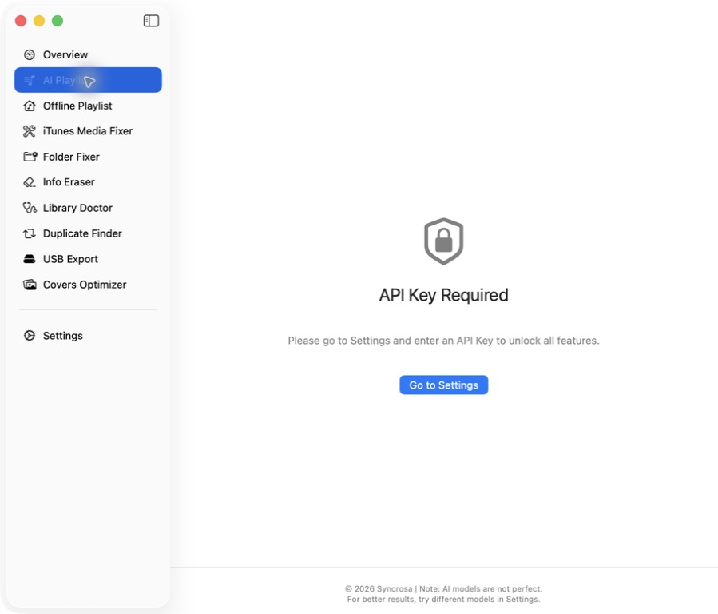
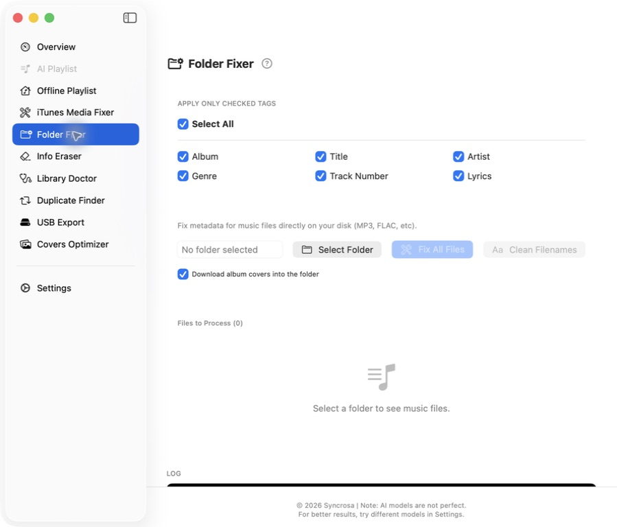
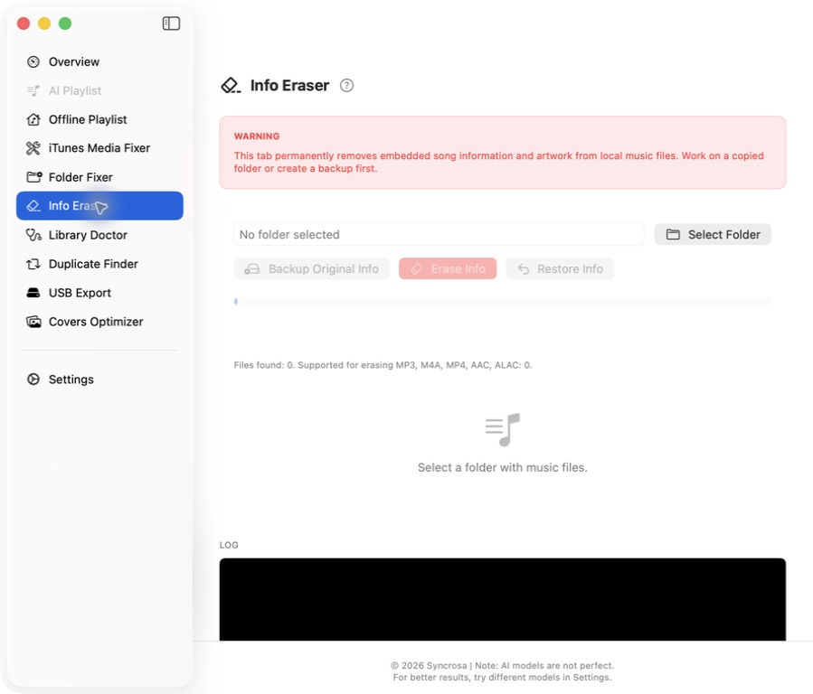

# Syncrosa 🎵🤖 (AI + Media Fixer)

  
  
<b>The ultimate power-tool for managing and creating Apple Music & iTunes playlists using AI.</b>

  

  
  
  
  
  
  

Welcome to the central hub for the **Syncrosa** ecosystem. This repository serves as the landing page and documentation hub for the project. 

The application is available in **three distinct versions**, tailored for different eras of Apple hardware.

---

## 🚀 The Applications

### 1. [syncrosa-swift](./syncrosa-swift) (Modern Apple Silicon)
A completely rewritten, native **SwiftUI** application designed exclusively for modern macOS (macOS 14 Sonoma and newer) running on Apple Silicon (M1/M2/M3/M4) chips.

- **Deep Music.app Integration:** Seamlessly interacts with the modern macOS Music application.
- **Liquid Glass UI:** A refreshed macOS 14+ interface with glassy controls, system Light/Dark appearance, and a native HUD notification system.
- **Advanced Security:** Uses macOS Keychain to securely store your API keys and employs Hardened Runtime for process safety.
- **Multi-Provider AI:** Supports generating playlists via Gemini, Groq, and OpenRouter (bypassing geo-blocks).
- **USB Export:** Transfer playlists directly to USB drives with format compatibility check and size optimization (.fitAvailable).
- **10+ Languages:** Fully localized out of the box.

### 2. [syncrosa-objc](./syncrosa-objc) (Native Legacy Cocoa)
A native, high-performance rewrite of the legacy track, built from the ground up using **Objective-C** and **Cocoa** for vintage Intel Macs running OS X 10.9 Mavericks and newer.

- **Classic iTunes Support:** Interacts directly with the legacy iTunes application.
- **Backwards-Compatible SDK:** Compiled to run natively on classic systems while maintaining modern parity.
- **Secure Keychain Storage:** Separate Keychain item storage for each AI provider.
- **Resilient Network Layer:** Spawns curl subprocesses when system openssl is too old to establish TLS 1.2+ handshakes.
- **Mavericks-Safe Cocoa UI:** AppKit controls are kept compatible with OS X 10.9 and Xcode 6.2-era behavior.
- **USB Export Tab:** Native Cocoa control panel for copying files to USB drives.

### 3. [syncrosa-python](./syncrosa-python) (Legacy Python Track)
The original stable version designed for vintage Macs running OS X 10.9 Mavericks through 10.13 High Sierra using system Python 2.7.x interpreter.

- **Stable Python Core:** The current stable build ensures 100% compatibility with older OS X versions.
- **Classic iTunes Support:** Interacts directly with the legacy iTunes application.
- **Resilient Network Layer:** Bypasses outdated OpenSSL 0.9.8 limitations on old Macs.

---

## ⚙️ Engineering Highlights
- **Native Performance:** Zero-dependency compilation tracks for both Modern (SwiftUI) and Legacy (Objective-C) builds.
- **Resilient Connectivity:** Custom network layer to bypass expired SSL certificates on vintage macOS.
- **Security-First:** Native Keychain integration and Hardened Runtime for process protection.
- **Zero Bloat:** Native codebases only—no Electron, no web-wrappers, just raw performance.

---

## 📥 How to Download & Run

You can find the compiled release versions in the [Releases](https://github.com/MiChiRose/Syncrosa/releases) section of this repository.

### Release Assets

| Archive | Best for | Minimum macOS | Notes |
| --- | --- | --- | --- |
| `Syncrosa_Cocoa_v3.4.3.zip` | Vintage Intel Macs, HDD systems, iTunes libraries | OS X 10.9 | Recommended legacy build for Mavericks-era machines; adds Recovery Center, HDD Safe Mode, and safer update/release-note checks. |
| `Syncrosa_Python_v3.4.3.zip` | Original legacy Python track | OS X 10.9 | Uses the system Python runtime where available, with aligned updater, history, and recovery polish. |
| `Syncrosa_SwiftUI_v3.4.3.zip` | Modern Apple Silicon Macs | macOS 14 | Modern Music.app build with polished Liquid Glass controls, Recovery Center, release notes, and smarter disabled actions. |

Release checksum files are generated as `SHA256SUMS.txt` next to the ZIP archives.

### Latest Release: 3.4.3

Syncrosa 3.4.3 focuses on safer long-running work, clearer recovery, and a more polished modern UI across the active app tracks:

- **Recovery Center:** SwiftUI, Objective-C, and Python builds now expose recovery/history locations and interrupted-operation markers more clearly.
- **Updates:** Check Updates can also expose release notes, while Update App stays disabled unless GitHub has a newer compatible package.
- **HDD Safety:** Objective-C gains HDD Safe Mode controls for gentler legacy-disk operation on older Intel Macs.
- **SwiftUI:** Liquid Glass controls are more readable, action buttons disable when required selections are missing, and release notes open in a dedicated sheet.
- **Docs:** README download instructions now point at the current 3.4.3 packages.

### Running the Application (Important)
Because the application is distributed directly without an Apple Developer certificate (it uses ad-hoc signing), macOS Gatekeeper will block the first launch.

**To open the app for the first time:**
1. Download and extract the release archive.
2. **Right-click** (or Control-click) the application icon and select **"Open"**.
3. macOS will warn you about an unidentified developer. Click **"Open"** again in the warning dialog.
4. From then on, you can launch the app normally with a double-click!

---

## ✨ Modern SwiftUI App Guide

The SwiftUI build is the modern Syncrosa experience for macOS 14+ on Apple Silicon. Screenshots below use the English interface; you can switch the app language at any time in **Settings**.

<b>1. Overview & Library Status</b>

Open **Overview** first to check the current Music library state and the safety mode before starting any operation.

1. **Library** shows how many tracks Syncrosa can currently read from Music.app.
2. **Only Local Mode** lets you skip online metadata lookups and work only with local files/library data.
3. **Quick Actions** can refresh Music.app detection, open Library Doctor, or reopen the first-launch setup.
4. **Current Safeguards** summarizes protections such as empty-library blocking and chunked long-running scans.

<b>2. Language, API Provider & Safe Defaults</b>

Use **Settings** to choose the interface language, configure an AI provider, and control safer offline behavior.

1. Select your preferred language from **Select Language**.
2. Choose **Gemini**, **Groq**, or **OpenRouter** as the AI provider.
3. Select a model, paste your API key, then click **Validate & Save Key**.
4. Enable **Only Local Mode** when you want Syncrosa to avoid online metadata lookups.
5. Open **Operation History** when you want to review previous operations by feature.

<b>3. AI Playlist Access</b>

The **AI Playlist** tab requires a validated API key and a readable Music library. If the app cannot safely start playlist generation yet, it blocks the tab and tells you what to fix first.

1. If you see **API Key Required**, open **Settings** and validate a provider key.
2. If Music.app has no readable tracks, refresh Music from **Overview** or add tracks to the library first.
3. After setup is complete, enter a playlist name, describe the mood, choose the track count, and generate the playlist.

<b>4. Folder Fixer & Filename Cleanup</b>

Use **Folder Fixer** for music files on disk. It works on a selected folder rather than directly inside Music.app.

1. Choose which tags Syncrosa is allowed to update.
2. Click **Select Folder** and pick the folder containing your music files.
3. Use **Fix All Files** to restore selected metadata fields.
4. Use **Clean Filenames** as a separate process when you want filename cleanup, including underscore-to-space normalization.
5. Keep **Download album covers into the folder** enabled when cover files should be saved next to the tracks.

<b>5. Info Eraser</b>

**Info Eraser** is intentionally separate because it is destructive. It removes embedded song information and artwork from local music files only; it does not operate directly on Music.app or iTunes libraries.

1. Work on a copied folder whenever possible.
2. Click **Select Folder** and review the detected supported files.
3. Click **Backup Original Info** before erasing metadata.
4. Click **Erase Info** only after confirming the warning dialog.
5. Use **Restore Info** if you need to restore metadata from the sidecar backup created by Syncrosa.

---

## 🌟 Legacy App Features Guide

Below is a detailed guide on how to set up and use the legacy Syncrosa application. 

<b>1. Initial Setup & AI Configuration (First Launch)</b>

When you open the application for the first time, you will be greeted by the **AI Provider Setup** window. Follow these steps:

1. **Choose your AI Provider:**
 * **OpenRouter (Recommended):** Best for users in regions where direct access to AI models might be restricted. It provides a stable gateway to many free models.
 * **Google Gemini / Groq:** Select these if you already have a direct subscription or API access to these services.
 * 

2. **Select an AI Model:**
 * **Author's Recommendation:** I personally suggest finding and selecting **`z-ai/glm-4.5-air:free`** (or its newer versions) in the list.
 * **Can't find the model?** Click the **Sync (🔄)** button to update the list from the server.
 * **Note:** Different models provide different results. Some might be more "creative," while others are more strictly focused on data. If one doesn't work, don't hesitate to try another!
 * 

3. **Get your API Key:**
 * Click the **Question Mark (?)** icon in the bottom corner of the setup window. This will open a helpful guide explaining exactly how to obtain your own free API key for each provider.
 * 

4. **Validate & Save:**
 * Paste your key into the input field and click **"Validate & Save Key"**.
 * **Success:** You will see a *"Success! Welcome"* message, and the window will close.
 * **Error:** If validation fails, double-check your key, ensure the selected model is currently available, and check your internet connection.

5. **Diagnostics:**
 * Normal release builds keep developer diagnostics hidden so users do not get extra log files on the Desktop. When deeper debugging is needed, diagnostics can be enabled explicitly during development.

<b>2. Generating Playlists (AI Genius Tab)</b>

Using the application is designed to be simple and intuitive:

1. **Playlist Name:** Enter what you want your new iTunes playlist to be called (e.g., *"My Ultimate Drive"*).
2. **Mood / Vibe:** Describe what kind of music you want to hear. Be as specific as you like (e.g., *"Upbeat energetic 80s synth-pop for a workout"*).
3. **Track Count:** Choose how many songs should be in the playlist (default is 25). 
 * *Note: The AI will try to find as many matches as possible from your local library, but it might return fewer than requested if your library is small.*
4. **Generate:** Click **"GENERATE PLAYLIST"** and wait a moment.
 * 

5. **Troubleshooting:** If the AI finds zero songs, try slightly changing your mood description or switching to a different AI model in the settings.

<b>3. Cleaning your Library (Media Fixer Tab)</b>

The **Media Fixer** tab helps keep your library organized:

1. **Start Restoration:** Click this button to begin a two-phase process.
2. **Phase 1 (Smart Merge):** The app looks for albums that were split apart (e.g., *"Artist - Hits"* vs *"Artist: Hits"*) and merges them into one.
3. **Phase 2 (Metadata Fetch):** The app connects to the Apple iTunes API to find and fill in missing Years, Genres, and Track info.
4. **Monitoring:** You can watch the real-time log console to see exactly which tracks are being processed.
 * 

---

## 🛠 Under the Hood

*   **The Evolution of Legacy:** Originally prototyped in **Python** for speed, the legacy track is now moving to a **Native Objective-C** core (syncrosa-objc). This transition eliminates the need for an external interpreter and brings true Cocoa-level responsiveness to older OS X platforms.
*   **Modern Architecture:** The modern version leverages **pure SwiftUI**, ensuring the app is power-efficient and fits perfectly into the modern macOS aesthetic while maintaining a lightning-fast compiled binary.
*   **Protocol Bridge:** We use custom automation and AppleScript bridges to ensure that regardless of the version (iTunes or Music.app), the AI-generated playlists are injected accurately and instantly.
*   **Network Resilience:** A custom socket-level wrapper and curl subprocess fallbacks are implemented in the legacy builds to bridge the gap between vintage OpenSSL versions and the strict security requirements of modern AI APIs.

---

## ⚠️ Compatibility & Security

**Supported OS & Hardware:**
- **syncrosa-swift:** Requires **macOS 14 Sonoma or newer** and an Apple Silicon (**M1/M2/M3/M4**) processor.
- **syncrosa-objc:** Designed strictly for **OS X 10.9 Mavericks and newer** on Intel/Apple Silicon Macs (supports modern API Keychain separation and USB export).
- **syncrosa-python:** Designed strictly for **OS X 10.9 Mavericks up to 10.13 High Sierra** on Intel Macs (original stable build).

**Security & Privacy:**
- **Local Storage Only:** Your API keys are stored only locally in `~/.syncrosa.json` (Python Legacy) or securely encrypted in the macOS Keychain (Swift & Obj-C).
- **No Data Collection:** The application does not collect or distribute your private data.

## 💬 Issues & Support

If you encounter any bugs or have suggestions, reach out via:
* **GitHub Issues:** [Issues](../../issues) section.
* **Email:** [yura.menschikov@icloud.com](mailto:yura.menschikov@icloud.com)

---
*Created with ❤️ for both the modern Apple Silicon and retro Mac communities.*
